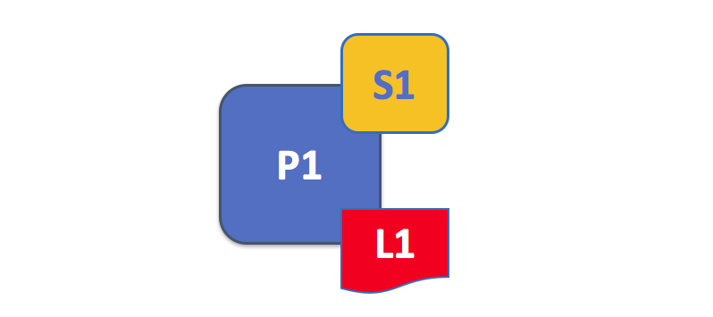

# 1 节点

A blockchain network is comprised primarily of a set of *peer nodes* (or, simply, *peers*). Peers are a fundamental element of the network because they host ledgers and smart contracts. Recall that a ledger immutably records all the transactions generated by smart contracts (which in Hyperledger Fabric are contained in a *chaincode*, more on this later). Smart contracts and ledgers are used to encapsulate the shared *processes* and shared *information* in a network, respectively. These aspects of a peer make them a good starting point to understand a Fabric network.

区块链网络主要由一组 Peer 节点（或者简单的称为 Peers）组成。节点是网络的基本元素，因为他们托管着账本和智能合约。回顾一下，账本不可篡改地记录了由智能合约生成的所有交易（在Hyperledger Fabric中智能合约被包含在**「链码」**中，稍后会对此进行更多介绍）。智能合约和账本别用于将共享的**「流程」**和共享的**「信息」**封装在网络中。这些特性使它们成为了解 Fabric 网络的良好起点。

Other elements of the blockchain network are of course important: ledgers and smart contracts, orderers, policies, channels, applications, organizations, identities, and membership, and you can read more about them in their own dedicated sections. This section focusses on peers, and their relationship to those other elements in a Fabric network.

区块链网络中的其他元素固然重要：账本与智能合约、orderers、策略、通道、应用程序，组织、身份和成员关系，您可以在它们的专用部分中阅读有关它们的更多信息。 本节重点介绍 Peers 及其与 Fabric 网络中其他元素的关系。

*A blockchain network is comprised of peer nodes, each of which can hold copies of ledgers and copies of smart contracts. In this example, the network N consists of peers P1, P2 and P3, each of which maintain their own instance of the distributed ledger L1. P1, P2 and P3 use the same chaincode, S1, to access their copy of that distributed ledger*.

> 区块链网络由 Peer 节点组成，每个 Peer节点都可以保存账本的副本和智能合约的副本。 在此示例中，网络N 由命名为P1，P2 和 P3 的 Peers 组成，每个P1，P2  和 P3 维护自己的分布式账本 L1 实例。 P1，P2 和 P3 使用相同的链码 S1 来访问它们的分布式账本的副本。

Peers can be created, started, stopped, reconfigured, and even deleted. They expose a set of APIs that enable administrators and applications to interact with the services that they provide. We'll learn more about these services in this section.

可以创建，启动，停止，重新配置甚至删除 Peers。 它们公开了一组 APIs，使管理员和应用程序可以与其提供的服务进行交互。 我们将在本节中了解关于这些服务的更多信息。

## 1 术语介绍

Fabric implements **smart contracts** with a technology concept it calls **chaincode** --- simply a piece of code that accesses the ledger, written in one of the supported programming languages. In this topic, we'll usually use the term **chaincode**, but feel free to read it as **smart contract** if you're more used to that term. It's the same thing! If you want to learn more about chaincode and smart contracts, check out our [documentation on smart contracts and chaincode](../smartcontract/smartcontract.html).

Fabric 用称为**「链码」**的技术概念来实现**「智能合约」** 。链码的简单定义就是「以一种受支持的编程语言编写」的一段访问账本的代码。 在本主题中，我们通常使用术语「链码」，但你也可以称其为「智能合约」， 这是同一件事！ 如果您想了解有关链码和智能合约的更多信息，请查看我们的 [关于智能合约和链码的文档](../ smartcontract / smartcontract.html)。

## 2 账本与链码

Let's look at a peer in a little more detail. We can see that it's the peer that hosts both the ledger and chaincode. More accurately, the peer actually hosts  *instances* of the ledger, and *instances* of chaincode. Note that this provides a deliberate redundancy in a Fabric network --- it avoids single points of failure. We'll learn more about the distributed and decentralized nature of a blockchain network later in this section.

让我们更仔细地康康一个 Peer 节点。 我们可以看到，同时托管账本和链码的是 Peer 节点。 更准确地说，Peer 节点实际上承载了账本的**实例**和链码的**实例**。 请注意，在 Fabric 网络中刻意设计的冗余是为了避免单点故障。 在本节后面，我们将了解有关区块链网络的分布式和去中心化性质的更多信息。

*A peer hosts instances of ledgers and instances of chaincodes. In this example, P1 hosts an instance of ledger L1 and an instance of chaincode S1. There can be many ledgers and chaincodes hosted on an individual peer.*

> 对等方托管分类帐实例和链码实例。 在此示例中，P1承载分类帐L1的实例和链码S1的实例。 在单个对等主机上可以托管许多分类帐和链码。

Because a peer is a *host* for ledgers and chaincodes, applications and administrators must interact with a peer if they want to access these resources. That's why peers are considered the most fundamental building blocks of a Fabric network. When a peer is first created, it has neither ledgers nor chaincodes. We'll see later how ledgers get created, and how chaincodes get installed, on peers.

由于 Peer 节点是账本和链码的**「主机」**，因此应用程序和管理员如果要访问这些资源，必须与 Peer 节点进行交互。 这就是为什么将 Peer 节点视为 Fabric 网络的最基本的「建筑砖块」。 首次创建 Peer 节点时，既没有账本，也没有链码。 稍后我们将看到在 Peer 节点上如何创建账本，以及如何安装链码。

### 2.1 多个账本

A peer is able to host more than one ledger, which is helpful because it allows for a flexible system design. The simplest configuration is for a peer to manage a single ledger, but it's absolutely appropriate for a peer to host two or more ledgers when required.

Peer 可以托管多个账本，这很有用处，因为这是一种可扩展的系统设计。最简单的配置是让 Peer 节点管理一个单独的账本，但是了 需要时 Peer 节点管理两个甚至更多的账本是非常合适的。

*A peer hosting multiple ledgers. Peers host one or more ledgers, and each
ledger has zero or more chaincodes that apply to them. In this example, we
can see that the peer P1 hosts ledgers L1 and L2. Ledger L1 is accessed using
chaincode S1. Ledger L2 on the other hand can be accessed using chaincodes S1 and S2.*

> 托管多个账本的 Peer节点。Peers  托管一个或多个账本，每个分类帐具有适用于它们的零个或多个链码。 在此示例中，我们可以看到 P1 承载着账本 L1 和 L2。 使用链码 S1 访问分账本。 另一方面，可以用链码 S1 和S2 访问账本 L2。

Although it is perfectly possible for a peer to host a ledger instance without hosting any chaincodes which access that ledger, it's rare that peers are configured this way. The vast majority of peers will have at least one chaincode installed on it which can query or update the peer's ledger instances. It's worth mentioning in passing that, whether or not users have installed chaincodes for use by external applications, peers also have special **system chaincodes** that are always present. These are not discussed in detail in this topic.

尽量 Peer 节点完全有可能托管一个张本示例而不托管一个访问该账本的链码，但是很少有 Peers 以这种方式配置。绝大多数 Peers 将至少安装一个链码，可以查询或更新 Peer 节点中的账本实例。需要提及的是，无论用户是否已安装供外部应用程序使用的链码，Peer 节点也始终具有特殊的**「系统链码」**，在本主题中将不对这个话题进行详细讨论。

### 2.2 多个链码

There isn't a fixed relationship between the number of ledgers a peer has and the number of chaincodes that can access that ledger. A peer might have many chaincodes and many ledgers available to it.

Peer 节点拥有的账本数量与可访问该账本的链码数量之间没有固定的关系，一个 Peer 可能拥有许多可用的恋爱与账本。

*An example of a peer hosting multiple chaincodes. Each ledger can have many chaincodes which access it. In this example, we can see that peer P1 hosts ledgers L1 and L2, where L1 is accessed by chaincodes S1 and S2, and L2 is accessed by S1 and S3. We can see that S1 can access both L1 and L2.*

> 上面这个例子显示的是一个 Peer 节点保存了多个链码。每个账本可被多个链码访问。在这个示例中，我们可以看到节点 P1 保存着账本 L1 和 L2，其中 L1 由链码 S1 和 S2 访问，而 L2 由 S1 和 S3 访问。我们可以看到，S1 既可以访问 L1 也可以访问 L2。

We'll see a little later why the concept of **channels** in Fabric is important
when hosting multiple ledgers or multiple chaincodes on a peer.

稍后我们将简单谈到为什么 Fabric 中的**「通道」**概念对于在节点上保存多个账本或多个链码来说非常重要。

## 3 应用程序与节点

We're now going to show how applications interact with peers to access the ledger. Ledger-query interactions involve a simple three-step dialogue between an application and a peer; ledger-update interactions are a little more involved, and require two extra steps. We've simplified these steps a little to help you get started with Fabric, but don't worry --- what's most important to understand is the difference in application-peer interactions for ledger-query compared to ledger-update transaction styles.

我们将展示的是应用程序如何通过与节点交互来访问账本。「账本查询交互」涉及了应用程序和节点之间简单的三步对话；「账本更新交互」稍微复杂一些，需要两个额外的步骤。为了帮助您开始使用 Fabric，我们稍微简化了这些步骤，但是不要担心——最关键的点在于，理解应用程序和节点之间进行的「账本查询」和「账本更新」，这两种交易类型之间有什么区别。

Applications always connect to peers when they need to access ledgers and chaincodes. The Fabric Software Development Kit (SDK) makes this easy for programmers --- its APIs enable applications to connect to peers, invoke chaincodes to generate transactions, submit transactions to the network that will get ordered, validated and committed to the distributed ledger, and receive events when this process is complete.

当应用程序需要访问账本和链码时，它们总是连接到 Peers 上。Fabric 软件开发工具包（SDK）让上述工作变得简单。首先，SDK 的 APIs 让应用程序连接到 Peers 上，随后调用链码来生成交易，接着向网络提交交易，网络将对这些交易进行排序并将其提交到账本上，最后当这一过程完成时，应用程序将接收到对应的「事件」。

Through a peer connection, applications can execute chaincodes to query or update a ledger. The result of a ledger query transaction is returned immediately, whereas ledger updates involve a more complex interaction between applications, peers and orderers. Let's investigate this in a little more detail.

通过与一个 Peer 节点连接，应用程序可以执行链码来查询或更新账本。账本查询交易的结果会立即返回，而账本更新交易涉及了应用程序、节点和排序服务之间更复杂的交互。让我们研究下细节。

*Peers, in conjunction with orderers, ensure that the ledger is kept up-to-date on every peer. In this example, application A connects to P1 and invokes chaincode S1 to query or update the ledger L1. P1 invokes S1 to generate a proposal response that contains a query result or a proposed ledger update. Application A receives the proposal response and, for queries, the process is now complete. For updates, A builds a transaction from all of the responses, which it sends to O1 for ordering. O1 collects transactions from across the network into blocks, and distributes these to all peers, including P1. P1 validates the transaction before committing to L1. Once L1 is updated, P1 generates an event, received by A, to signify completion.*

> 节点与 orderers（排序者） 一起发挥作用，保证每个节点上的账本都是最新的。在本例中，应用程序 A 连接到节点 P1 上，并调用链码 S1 来查询或更新 L1。 P1 调用 S1 来生成一个包含「查询结果」或者「账本拟更新」的提案响应。应用程序 A 接收到提案响应，对于查询来说，流程到这里就已经完成了。而对于更新来说，A 会基于所有响应生成一个交易，并将其发送到排序服务 O1 进行排序。O1 将网络上的所有交易收集到区块中并分发给包括 P1 在内的所有节点。P1 对交易进行验证，随后将其提交到账本 L1 上。一旦 L1 更新完毕，P1 会生成一个事件，随后 A 收到这一事件，标志着整个过程结束。

A peer can return the results of a query to an application immediately since all of the information required to satisfy the query is in the peer's local copy of the ledger. Peers never consult with other peers in order to respond to a query from an application. Applications can, however, connect to one or more peers to issue a query; for example, to corroborate a result between multiple peers, or retrieve a more up-to-date result from a different peer if there's a suspicion that information might be out of date. In the diagram, you can see that ledger query is a simple three-step process.

因为节点的「账本的本地副本」中包含了账本查询所需的全部信息，所以节点可以立即将查询结果返回给应用程序。节点从不通过与其他节点协商来响应应用程序发出的查询。但是，应用程序可以连接到一个或多个节点上来执行查询；例如，在多个节点之间验证结果；又或怀疑信息不是最新的，可以从另一个节点上检索最新的结果。在图中，您可以看到账本查询是只需要三个步骤，非常简单。

An update transaction starts in the same way as a query transaction, but has two extra steps. Although ledger-updating applications also connect to peers to invoke a chaincode, unlike with ledger-querying applications, an individual peer cannot perform a ledger update at this time, because other peers must first agree to the change --- a process called **consensus**. Therefore, peers return to the application a **proposed** update --- one that this peer would apply subject to other peers' prior agreement. The first extra step --- step four --- requires that applications send an appropriate set of matching proposed updates to the entire network of peers as a transaction for commitment to their respective ledgers. This is achieved by the application by using an **orderer** to package transactions into blocks, and distributing them to the entire network of peers, where they can be verified before being applied to each peer's local copy of the ledger. As this whole ordering processing takes some time to complete (seconds), the application is notified asynchronously, as shown in step five.

更新交易的开始方式和查询交易的一样，但是多了两个额外的步骤。虽然「账本更新应用程序」和「账本查询应用程序」一样，也是连接到节点上来调用链码的，但不同的是，单个节点无法执行账本更新，这是由于其他节点必须首先同意这一改变，我们把这个过程称为**共识**。因此，节点向应用程序返回一个**拟**更新——该节点将在其他节点事先同意的情况下应用该更新。第一个额外步骤（步骤4）要求应用程序向全网络中的所有节点发送一组适当的拟更新，以作为向各自账本提交的交易。该步骤是由应用程序实现的，**排序者**将交易打包成区块，并将这些交易区块分发到网络中所有的节点上，节点在将这些交易提交到各自的「本地账本副本」之前会对其进行验证。如步骤 5 所示，由于整个排序服务需要一些时间（几秒钟）才能完成，因此应用程序收到的是异步通知。

Later in this section, you'll learn more about the detailed nature of this ordering process --- and for a really detailed look at this process see the [Transaction Flow](../txflow.html) topic.

下文中将继续讨论排序服务的详细特性，想要深入了解此流程，请参阅[交易流程](https://stone-fabric.readthedocs.io/zh/latest/txflow.html)主题。

## Peers and Channels

Although this section is about peers rather than channels, it's worth spending a
little time understanding how peers interact with each other, and with applications,
via *channels* --- a mechanism by which a set of components within a blockchain
network can communicate and transact *privately*.

These components are typically peer nodes, orderer nodes and applications and,
by joining a channel, they agree to collaborate to collectively share and
manage identical copies of the ledger associated with that channel. Conceptually, you can
think of channels as being similar to groups of friends (though the members of a
channel certainly don't need to be friends!). A person might have several groups
of friends, with each group having activities they do together. These groups
might be totally separate (a group of work friends as compared to a group of
hobby friends), or there can be some crossover between them. Nevertheless, each group
is its own entity, with "rules" of a kind.

*Channels allow a specific set of peers and applications to communicate with
each other within a blockchain network. In this example, application A can
communicate directly with peers P1 and P2 using channel C. You can think of the
channel as a pathway for communications between particular applications and
peers. (For simplicity, orderers are not shown in this diagram, but must be
present in a functioning network.)*

We see that channels don't exist in the same way that peers do --- it's more
appropriate to think of a channel as a logical structure that is formed by a
collection of physical peers. *It is vital to understand this point --- peers
provide the control point for access to, and management of, channels*.

## Peers and Organizations

Now that you understand peers and their relationship to ledgers, chaincodes
and channels, you'll be able to see how multiple organizations come together to
form a blockchain network.

Blockchain networks are administered by a collection of organizations rather
than a single organization. Peers are central to how this kind of distributed
network is built because they are owned by --- and are the connection points to
the network for --- these organizations.

*Peers in a blockchain network with multiple organizations. The blockchain
network is built up from the peers owned and contributed by the different
organizations. In this example, we see four organizations contributing eight
peers to form a network. The channel C connects five of these peers in the
network N --- P1, P3, P5, P7 and P8. The other peers owned by these
organizations have not been joined to this channel, but are typically joined to
at least one other channel. Applications that have been developed by a
particular organization will connect to their own organization's peers as well
as those of different organizations. Again,
for simplicity, an orderer node is not shown in this diagram.*

It's really important that you can see what's happening in the formation of a
blockchain network. *The network is both formed and managed by the multiple
organizations who contribute resources to it.* Peers are the resources that
we're discussing in this topic, but the resources an organization provides are
more than just peers. There's a principle at work here --- the network literally
does not exist without organizations contributing their individual resources to
the collective network. Moreover, the network grows and shrinks with the
resources that are provided by these collaborating organizations.

You can see that (other than the ordering service) there are no centralized
resources --- in the [example above](#Peer8), the network, **N**, would not exist
if the organizations did not contribute their peers. This reflects the fact that
the network does not exist in any meaningful sense unless and until
organizations contribute the resources that form it. Moreover, the network does
not depend on any individual organization --- it will continue to exist as long
as one organization remains, no matter which other organizations may come and
go. This is at the heart of what it means for a network to be decentralized.

Applications in different organizations, as in the [example above](#Peer8), may
or may not be the same. That's because it's entirely up to an organization as to how
its applications process their peers' copies of the ledger. This means that both
application and presentation logic may vary from organization to organization
even though their respective peers host exactly the same ledger data.

Applications connect either to peers in their organization, or peers in another
organization, depending on the nature of the ledger interaction that's required.
For ledger-query interactions, applications typically connect to their own
organization's peers. For ledger-update interactions, we'll see later why
applications need to connect to peers representing *every* organization that is
required to endorse the ledger update.

## Peers and Identity

Now that you've seen how peers from different organizations come together to
form a blockchain network, it's worth spending a few moments understanding how
peers get assigned to organizations by their administrators.

Peers have an identity assigned to them via a digital certificate from a
particular certificate authority. You can read lots more about how X.509
digital certificates work elsewhere in this guide but, for now, think of a
digital certificate as being like an ID card that provides lots of verifiable
information about a peer. *Each and every peer in the network is assigned a
digital certificate by an administrator from its owning organization*.

*When a peer connects to a channel, its digital certificate identifies its
owning organization via a channel MSP. In this example, P1 and P2 have
identities issued by CA1. Channel C determines from a policy in its channel
configuration that identities from CA1 should be associated with Org1 using
ORG1.MSP. Similarly, P3 and P4 are identified by ORG2.MSP as being part of
Org2.*

Whenever a peer connects using a channel to a blockchain network, *a policy in
the channel configuration uses the peer's identity to determine its
rights.* The mapping of identity to organization is provided by a component
called a *Membership Service Provider* (MSP) --- it determines how a peer gets
assigned to a specific role in a particular organization and accordingly gains
appropriate access to blockchain resources. Moreover, a peer can be owned only
by a single organization, and is therefore associated with a single MSP. We'll
learn more about peer access control later in this section, and there's an entire
section on MSPs and access control policies elsewhere in this guide. But for now,
think of an MSP as providing linkage between an individual identity and a
particular organizational role in a blockchain network.

To digress for a moment, peers as well as *everything that interacts with a
blockchain network acquire their organizational identity from their digital
certificate and an MSP*. Peers, applications, end users, administrators and
orderers must have an identity and an associated MSP if they want to interact
with a blockchain network. *We give a name to every entity that interacts with
a blockchain network using an identity --- a principal.* You can learn lots
more about principals and organizations elsewhere in this guide, but for now
you know more than enough to continue your understanding of peers!

Finally, note that it's not really important where the peer is physically
located --- it could reside in the cloud, or in a data centre owned by one
of the organizations, or on a local machine --- it's the digital certificate
associated with it that identifies it as being owned by a particular organization.
In our example above, P3 could be hosted in Org1's data center, but as long as the
digital certificate associated with it is issued by CA2, then it's owned by
Org2.

## Peers and Orderers

We've seen that peers form the basis for a blockchain network, hosting ledgers
and smart contracts which can be queried and updated by peer-connected applications.
However, the mechanism by which applications and peers interact with each other
to ensure that every peer's ledger is kept consistent with each other is mediated
by special nodes called *orderers*, and it's to these nodes we now turn our
attention.

An update transaction is quite different from a query transaction because a single
peer cannot, on its own, update the ledger --- updating requires the consent of other
peers in the network. A peer requires other peers in the network to approve a
ledger update before it can be applied to a peer's local ledger. This process is
called *consensus*, which takes much longer to complete than a simple query. But when
all the peers required to approve the transaction    do so, and the transaction is
committed to the ledger, peers will notify their connected applications that the
ledger has been updated. You're about to be shown a lot more detail about how
peers and orderers manage the consensus process in this section.

Specifically, applications that want to update the ledger are involved in a
3-phase process, which ensures that all the peers in a blockchain network keep
their ledgers consistent with each other. 

* In the first phase, applications work with a subset of *endorsing peers*, each of
  which provide an endorsement of the proposed ledger update to the application,
  but do not apply the proposed update to their copy of the ledger.
* In the second phase, these separate endorsements are collected together
  as transactions and packaged into blocks.
* In the third and final phase, these blocks are distributed back to every peer where
  each transaction is validated before being committed to that peer's copy of the ledger.

As you will see, orderer nodes are central to this process, so let's
investigate in a little more detail how applications and peers use orderers to
generate ledger updates that can be consistently applied to a distributed,
replicated ledger.

### Phase 1: Proposal

Phase 1 of the transaction workflow involves an interaction between an
application and a set of peers --- it does not involve orderers. Phase 1 is only
concerned with an application asking different organizations' endorsing peers to
agree to the results of the proposed chaincode invocation.

To start phase 1, applications generate a transaction proposal which they send
to each of the required set of peers for endorsement. Each of these *endorsing peers* then
independently executes a chaincode using the transaction proposal to
generate a transaction proposal response. It does not apply this update to the
ledger, but rather simply signs it and returns it to the application. Once the
application has received a sufficient number of signed proposal responses,
the first phase of the transaction flow is complete. Let's examine this phase in
a little more detail.

*Transaction proposals are independently executed by peers who return endorsed
proposal responses. In this example, application A1 generates transaction T1
proposal P which it sends to both peer P1 and peer P2 on channel C. P1 executes
S1 using transaction T1 proposal P generating transaction T1 response R1 which
it endorses with E1. Independently, P2 executes S1 using transaction T1
proposal P generating transaction T1 response R2 which it endorses with E2.
Application A1 receives two endorsed responses for transaction T1, namely E1
and E2.*

Initially, a set of peers are chosen by the application to generate a set of
proposed ledger updates. Which peers are chosen by the application? Well, that
depends on the *endorsement policy* (defined for a chaincode), which defines
the set of organizations that need to endorse a proposed ledger change before it
can be accepted by the network. This is literally what it means to achieve
consensus --- every organization who matters must have endorsed the proposed
ledger change *before* it will be accepted onto any peer's ledger.

A peer endorses a proposal response by adding its digital signature, and signing
the entire payload using its private key. This endorsement can be subsequently
used to prove that this organization's peer generated a particular response. In
our example, if peer P1 is owned by organization Org1, endorsement E1
corresponds to a digital proof that "Transaction T1 response R1 on ledger L1 has
been provided by Org1's peer P1!".

Phase 1 ends when the application receives signed proposal responses from
sufficient peers. We note that different peers can return different and
therefore inconsistent transaction responses to the application *for the same
transaction proposal*. It might simply be that the result was generated at
different times on different peers with ledgers at different states, in which
case an application can simply request a more up-to-date proposal response. Less
likely, but much more seriously, results might be different because the chaincode
is *non-deterministic*. Non-determinism is the enemy of chaincodes
and ledgers and if it occurs it indicates a serious problem with the proposed
transaction, as inconsistent results cannot, obviously, be applied to ledgers.
An individual peer cannot know that their transaction result is
non-deterministic --- transaction responses must be gathered together for
comparison before non-determinism can be detected. (Strictly speaking, even this
is not enough, but we defer this discussion to the transaction section, where
non-determinism is discussed in detail.)

At the end of phase 1, the application is free to discard inconsistent
transaction responses if it wishes to do so, effectively terminating the
transaction workflow early. We'll see later that if an application tries to use
an inconsistent set of transaction responses to update the ledger, it will be
rejected.

### Phase 2: Ordering and packaging transactions into blocks

The second phase of the transaction workflow is the packaging phase. The orderer
is pivotal to this process --- it receives transactions containing endorsed
transaction proposal responses from many applications, and orders the
transactions into blocks. For more details about the
ordering and packaging phase, check out our
[conceptual information about the ordering phase](../orderer/ordering_service.html#phase-two-ordering-and-packaging-transactions-into-blocks).

### Phase 3: Validation and commit

At the end of phase 2, we see that orderers have been responsible for the simple
but vital processes of collecting proposed transaction updates, ordering them,
and packaging them into blocks, ready for distribution to the peers.

The final phase of the transaction workflow involves the distribution and
subsequent validation of blocks from the orderer to the peers, where they can be
committed to the ledger. Specifically, at each peer, every transaction within a
block is validated to ensure that it has been consistently endorsed by all
relevant organizations before it is committed to the ledger. Failed transactions
are retained for audit, but are not committed to the ledger.

*The second role of an orderer node is to distribute blocks to peers. In this
example, orderer O1 distributes block B2 to peer P1 and peer P2. Peer P1
processes block B2, resulting in a new block being added to ledger L1 on P1.
In parallel, peer P2 processes block B2, resulting in a new block being added
to ledger L1 on P2. Once this process is complete, the ledger L1 has been
consistently updated on peers P1 and P2, and each may inform connected
applications that the transaction has been processed.*

Phase 3 begins with the orderer distributing blocks to all peers connected to
it. Peers are connected to orderers on channels such that when a new block is
generated, all of the peers connected to the orderer will be sent a copy of the
new block. Each peer will process this block independently, but in exactly the
same way as every other peer on the channel. In this way, we'll see that the
ledger can be kept consistent. It's also worth noting that not every peer needs
to be connected to an orderer --- peers can cascade blocks to other peers using
the **gossip** protocol, who also can process them independently. But let's
leave that discussion to another time!

Upon receipt of a block, a peer will process each transaction in the sequence in
which it appears in the block. For every transaction, each peer will verify that
the transaction has been endorsed by the required organizations according to the
*endorsement policy* of the chaincode which generated the transaction. For
example, some transactions may only need to be endorsed by a single
organization, whereas others may require multiple endorsements before they are
considered valid. This process of validation verifies that all relevant
organizations have generated the same outcome or result. Also note that this
validation is different than the endorsement check in phase 1, where it is the
application that receives the response from endorsing peers and makes the
decision to send the proposal transactions. In case the application violates
the endorsement policy by sending wrong transactions, the peer is still able to
reject the transaction in the validation process of phase 3.

If a transaction has been endorsed correctly, the peer will attempt to apply it
to the ledger. To do this, a peer must perform a ledger consistency check to
verify that the current state of the ledger is compatible with the state of the
ledger when the proposed update was generated. This may not always be possible,
even when the transaction has been fully endorsed. For example, another
transaction may have updated the same asset in the ledger such that the
transaction update is no longer valid and therefore can no longer be applied. In
this way, the ledger is kept consistent across each peer in the channel because
they each follow the same rules for validation.

After a peer has successfully validated each individual transaction, it updates
the ledger. Failed transactions are not applied to the ledger, but they are
retained for audit purposes, as are successful transactions. This means that
peer blocks are almost exactly the same as the blocks received from the orderer,
except for a valid or invalid indicator on each transaction in the block.

We also note that phase 3 does not require the running of chaincodes --- this is
done only during phase 1, and that's important. It means that chaincodes only have
to be available on endorsing nodes, rather than throughout the blockchain
network. This is often helpful as it keeps the logic of the chaincode
confidential to endorsing organizations. This is in contrast to the output of
the chaincodes (the transaction proposal responses) which are shared with every
peer in the channel, whether or not they endorsed the transaction. This
specialization of endorsing peers is designed to help scalability and confidentiality.

Finally, every time a block is committed to a peer's ledger, that peer
generates an appropriate *event*. *Block events* include the full block content,
while *block transaction events* include summary information only, such as
whether each transaction in the block has been validated or invalidated.
*Chaincode* events that the chaincode execution has produced can also be
published at this time. Applications can register for these event types so
that they can be notified when they occur. These notifications conclude the
third and final phase of the transaction workflow.

In summary, phase 3 sees the blocks which are generated by the orderer
consistently applied to the ledger. The strict ordering of transactions into
blocks allows each peer to validate that transaction updates are consistently
applied across the blockchain network.

### Orderers and Consensus

This entire transaction workflow process is called *consensus* because all peers
have reached agreement on the order and content of transactions, in a process
that is mediated by orderers. Consensus is a multi-step process and applications
are only notified of ledger updates when the process is complete --- which may
happen at slightly different times on different peers.

We will discuss orderers in a lot more detail in a future orderer topic, but for
now, think of orderers as nodes which collect and distribute proposed ledger
updates from applications for peers to validate and include on the ledger.

That's it! We've now finished our tour of peers and the other components that
they relate to in Fabric. We've seen that peers are in many ways the
most fundamental element --- they form the network, host chaincodes and the
ledger, handle transaction proposals and responses, and keep the ledger
up-to-date by consistently applying transaction updates to it.

<!--- Licensed under Creative Commons Attribution 4.0 International License
https://creativecommons.org/licenses/by/4.0/) -->
